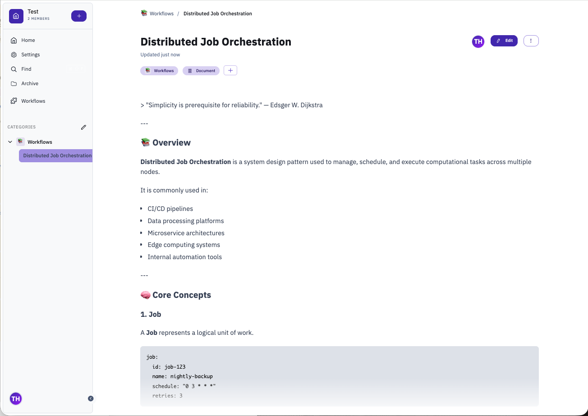

# Vektor — A Self-Hosted Wiki Built for Teams

Vektor is a self-hosted documentation platform I've been building as an alternative to tools like Notion or Confluence. The core idea: keep it minimal, keep it fast, and make it extensible.

It's built on [Astro](https://astro.build/) + [Vue 3](https://vuejs.org/) with a [Tiptap](https://tiptap.dev/) editor, [libSQL](https://github.com/tursodatabase/libsql) for storage, and [Bun](https://bun.sh/) as the runtime.

---

## The Editor

The editor is the heart of the app. It supports the things you'd expect — headings, lists, tables, code blocks, images — but also multi-column layouts, inline mentions (`@user`), table formulas, and a slash-command palette for quick access to any action.


Real-time multiplayer collaboration is built in via [Yjs](https://yjs.dev/), so multiple people can work on the same document simultaneously with live cursors.

---

## Spaces

Documents are organized into **Spaces** — isolated workspaces with their own members, categories, and document hierarchy. Each space can be personalized, and access is controlled per-space. Documents can be tagged, assigned to contributors, and organized into nested categories.



---

## Extensions

One of the more unusual features is the extension system. Extensions are packaged bundles that add new functionality to a space — custom views, editor commands, sidebar panels, or entirely new interfaces like a Kanban board or calendar.


Built-in extensions include a GitLab integration, a media browser, a calendar, and a workflow builder. The CLI makes it straightforward to scaffold, package, and deploy them:

```bash
vektor extension create my-extension
vektor extension package my-extension
vektor extension upload my-extension --url https://wiki.example.com --space my-space --token $TOKEN
```

---

## Workflows

Workflows are automation pipelines attached to documents. They can be triggered manually or via API and accept typed inputs. The CLI can run them directly:

```bash
vektor workflow abc123 --input file=https://example.com/data.xlsx --json
```

This makes it easy to use a document as a "runbook" — trigger a workflow from CI, pass in dynamic parameters, and get structured output back.

---

## CLI

The `vektor` CLI provides scripting access to most of the platform:

```bash
vektor document ls
vektor document search "distributed systems"
vektor document cat <docId>
vektor document write <docId>   # pipe stdin into a document
```

Combined with environment variables (`WIKI_HOST`, `WIKI_SPACE_ID`, `WIKI_ACCESS_TOKEN`), this makes Vektor easy to integrate into existing toolchains.

---

## Commands Palette


The command palette (`/`) gives access to all editor actions, extensions, and imports. Pandoc is used under the hood for importing external formats (Word, Markdown, HTML, etc.).

---

## Tech Stack at a Glance

| Layer | Choice |
|---|---|
| Runtime | Bun |
| Framework | Astro + Vue 3 |
| Editor | Tiptap + Yjs |
| Database | libSQL (SQLite/Turso) |
| ORM | Drizzle |
| Auth | better-auth (OAuth2/SSO) |
| Observability | OpenTelemetry |
| Styles | Tailwind CSS v4 |

---

It's still a proof-of-concept but already usable day-to-day. The extension system is what I'm most excited about — it keeps the core lean while letting you bolt on whatever your team actually needs.
